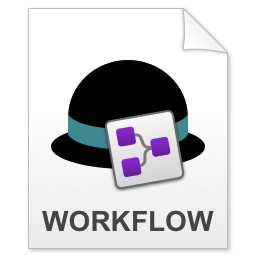
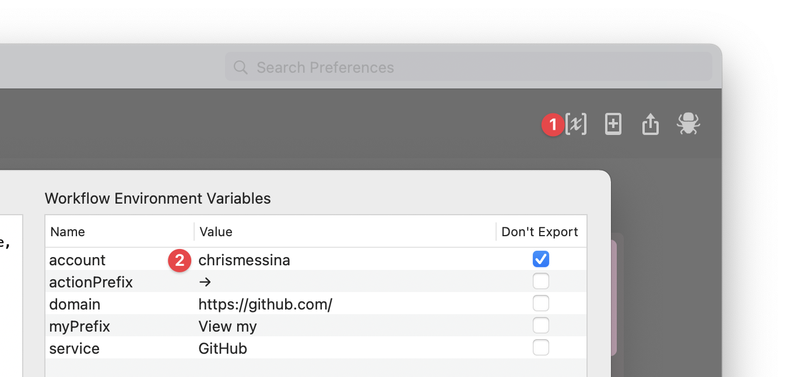

# Alfred Toolkit for GitHub

The GitHub Toolkit for Alfred makes it easy to quickly access GitHub's web features, including Pull Requests, Issues, Explore, Trending and more with the `github` keyword.

You can also quickly access your own GitHub content once you've set up your account (see below) with the `my` keyword.

You can also create new repositories, gists, organizations, and projects with the `new` keyword.

You will need to be signed in to your GitHub account in your default web browser to make the most of this workflow.

This workflow doesn't support programmatic access to GitHub. For that, I would recommend [GitHub Repos workflow for Alfred](https://github.com/edgarjs/alfred-github-repos) by [@edgarjs](https://github.com/edgarjs) or [GitHub Search](https://github.com/pawelgrzybek/alfred-github-search) by [@pawelgrzybek](https://github.com/pawelgrzybek/).

# Installation

1. Download [alfred-github-toolkit.alfredworkflow](https://github.com/chrismessina/alfred-github-toolkit/releases/latest).
2. Double-click `alfred-github-toolkit.alfredworkflow` to install it.

_You will need to be an [Alfred Powerpack](https://www.alfredapp.com/powerpack/) user to enable this workflow._

# Configuration

Once the workflow is installed, launch **Alfred Preferences**, choose **Workflows** and then select **GitHub Toolkit**.

➊ Access the **Workflow Environment Variables** in the top right of the window:

## Set your account

This workflow makes it easy to access your own GitHub content using the `my` keyword.

➋ To configure this feature, you must set the `account` variable in the configuration to *your own username*.

# Changelog[¹](https://keepachangelog.com/)

## [v0.1.0] - 2021-06-11
- Initial Release

# About

This workflow is unaffiliated with nor endorsed by GitHub, Inc.

[Discuss this workflow](https://www.alfredforum.com/topic/16992-alfred-toolkit-for-github/) on the Alfred Forum.

You can [file bugs](https://github.com/chrismessina/alfred-github-toolkit/issues/new) or [submit feature requests](https://github.com/chrismessina/alfred-github-toolkit/issues/new) on GitHub.
